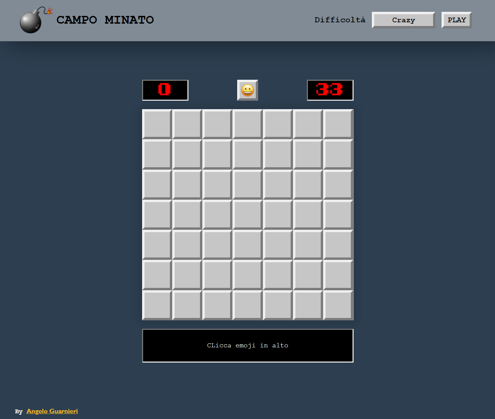
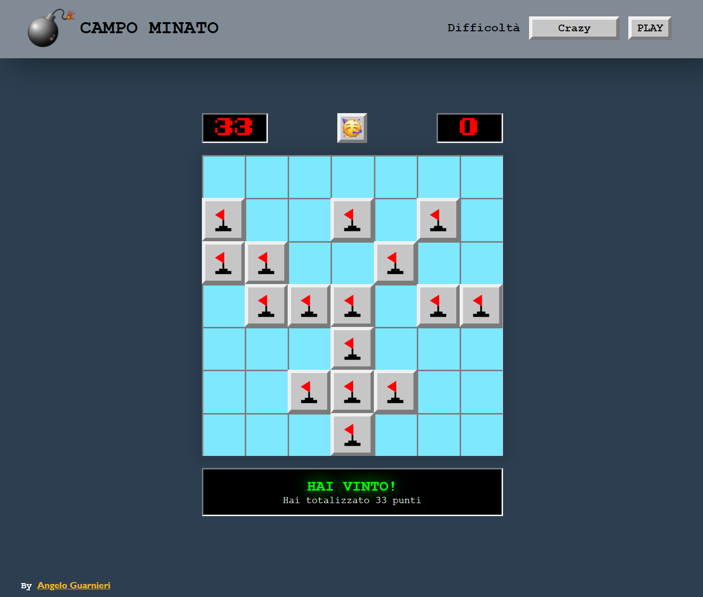

<h1 align="center" title="Unicode Formatter">ＣＡＭＰＯＭＩＮＡＴＯ</h1>

💣 Pᴇʀꜱᴏɴᴀʟ Mɪɴᴇꜱᴡᴇᴇᴩᴇʀ ɢᴀᴍᴇ 💥

<h3 align="center">
𝙑𝙞𝙚𝙬 𝙨𝙞𝙩𝙚

</h3>

## 

## 📸 Screenshots

  
  

## 👨‍💻 Tecnologies, addons and plugins used:
- HTML;
- CSS;
- JS;
- [Font Awesome](https://fontawesome.com "Font Awesome's Homepage") for some icons.
